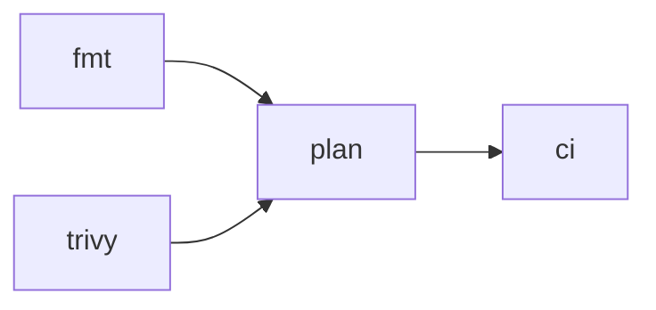

# github-settings

Manages ojhermann's GitHub account settings via [OpenTofu](https://opentofu.org) using the [GitHub provider](https://registry.terraform.io/providers/integrations/github/latest/docs).

## Prerequisites

- [OpenTofu](https://opentofu.org/docs/intro/install/) >= 1.10
- A GitHub personal access token with scopes: `repo`, `admin:org`, `delete_repo`, `workflow`
- A Cloudflare account with R2 enabled

## Setup

### 1. Create the R2 bucket

In the Cloudflare dashboard: **R2 → Create bucket**, name it `tofu-state`.

### 2. Get your Account ID

Cloudflare dashboard → R2 → Overview — your Account ID is in the right sidebar.
Replace `REPLACE_WITH_CLOUDFLARE_ACCOUNT_ID` in `versions.tf`.

### 3. Create an R2 API token

Cloudflare dashboard → R2 → Manage R2 API Tokens → Create API Token.
Give it **Object Read & Write** permission scoped to the `tofu-state` bucket.

### 4. Authenticate

```bash
# R2 credentials (used as S3-compatible access keys)
export AWS_ACCESS_KEY_ID="<R2 Access Key ID>"
export AWS_SECRET_ACCESS_KEY="<R2 Secret Access Key>"

# GitHub token
export GITHUB_TOKEN="ghp_..."
```

### 5. Initialize

```bash
tofu init
```

## Importing Existing Resources

Import blocks are defined in `imports.tf`. To generate resource config from live GitHub state:

```bash
tofu plan -generate-config-out=generated_repositories.tf
```

Review `generated_repositories.tf`, move the resource blocks you want to keep into `repositories.tf`, then:

```bash
tofu apply
```

After a successful apply, delete `generated_repositories.tf` and remove the corresponding `import` blocks from `imports.tf`.

## Day-to-day Usage

```bash
export GITHUB_TOKEN="ghp_..."
tofu plan   # preview changes
tofu apply  # apply changes
```

## CI Strategy

CI is enforced at the org level: `github_organization_ruleset.default_branch` in `organization.tf` requires a check named `ci` to pass before any PR can merge to the default branch across all repos.

Each repo is responsible for defining what CI does — github-settings only cares that a job named `ci` passes. The convention every repo follows is:

1. Define whatever jobs make sense (linting, formatting, tests, plan, etc.)
2. Add a `ci` gate job that `needs` all of them, with `if: always()` so it fails rather than skips when an upstream job fails

This separates concerns cleanly: github-settings owns *that* CI must pass; each repo owns *what* CI does. Adding, removing, or renaming jobs in a repo never requires a change here.

> **Note:** This is a convention, not a technical enforcement. Nothing prevents a repo from having a `ci` job that depends on nothing. For a personal org this is a non-issue, but worth keeping in mind if the org grows.

### Example: this repo



`fmt` and `trivy` run in parallel, then `plan` runs once both pass, then `ci` acts as the gate. The org ruleset sees `ci` pass or fail.

## Managed Resources

| Resource | File |
|----------|------|
| Org settings | `organization.tf` |
| Branch protection / CI enforcement | `organization.tf` |
| Repositories | `repositories.tf` |
